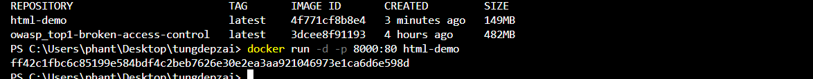

# 1. sau đây là cách deploy 1 dự ạm HTML lên Docker 
---

## 1.1. lấy template trên đây 

[Ở đâyyyy ](https://themewagon.com/themes/template-collection-2023-hundred-pre-built-websites-for-free/)

sau đó lấy về visual studio như hình sau :

 

## 1.2. tạo 1 file Dockerfile 

như hình sau : 

                        cài extension nhé !!!!!

sau đó viết file Dockefile 

    FROM nginx:1.23
    COPY ./ /usr/share/nginx/html 

`giải thích câu lệnh trên `

`FROM nginx:1.23` $\to$ xây dựng 1 image dựa trên image mặc định nginx:1.23 ( tải môi trường về )

`COPY ./ /usr/share/nginx/html` $\to$ sao chép tất cả các nội dung tĩnh trong folder để đưa vào thư mục mà máy chủ web NGINX sử dụng dể phục vụ cho nội dung web (hay nói cách khác đó là thay thế nội dung html mặc định của web server ) 

## 1.3. tạo ra 1 Image 

mở terminal và dùng lệnh sau 
    
    docker build -t html-demo . 

`docker build` : lệnh yêu cầu xây dựng 1 Image 

***khi build image phải vào đúng file nguồn***

`-t` : viết tắt của tag ở dây ta gắn tên của hình ảnh là html-demo 

`.` : đường dẫn đến thư mục Dockerfile ở đây là image local 

**docker thực hiện hai bước**

1: tải về 

2: copy thư mục gốc sang  

***Image xuất hiện trên docker như sau :***

tìm xem có bao nhiêu Image trên đocker

    docker images

## 1.4. Tạo container

    docker run -d -p 8000:80 html-demo

`-d` : container sẽ chạy ẩn danh không xuất hiện đầu ra đầu vào trên terminal 

`-p 8000:80` : ánh xạ cổng 8000 trên máy chủ với cổng 80 trong container . Điều này cho phép truy cập container thông qua cổng 8000 trên máy chủ của bạn 

`html-demo` : tên của image hoặc có thể dùng id của image 

$\to$ sau đó sẽ xuất hiện id của container để chúng ta chạy như hình sau : 

giờ sẽ xem container nào đang chạy : 

mở docker lên và ấn vào port là xong 

thành công deploy !!!!!! 